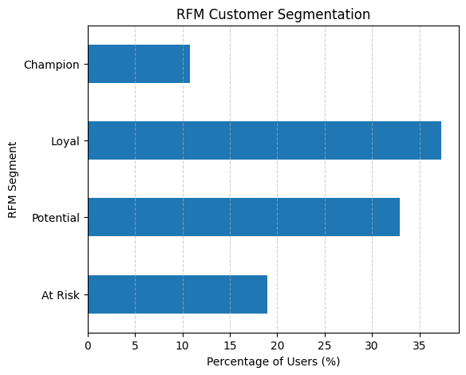
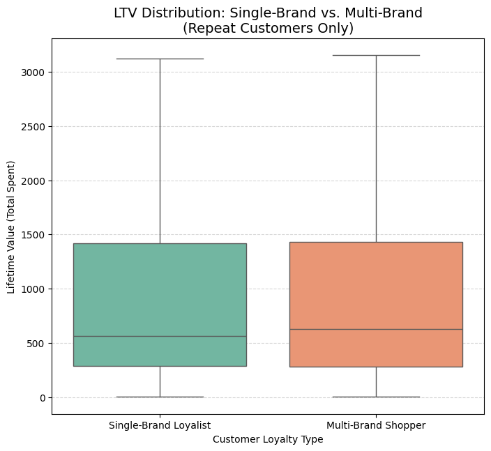
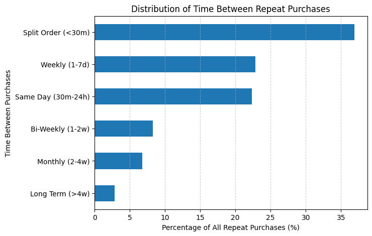
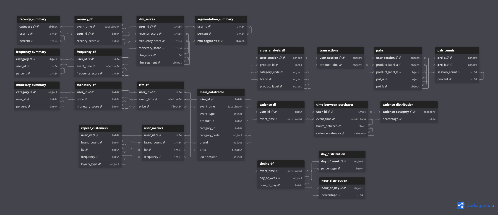

# E-Commerce Customer Intelligence: Maximizing Retention & Lifetime Value

  

## 1. Executive Summary
**The Goal:** A multi-category online retailer sought to transform 110 million raw user event logs into an actionable customer retention strategy. The primary objectives were to identify high-value segments, optimize cross-selling, and understand purchase timing behaviors.

**The Result:** The analysis revealed that while **57% of customers are one-time buyers**, there is a significant revenue opportunity in cultivating multi-brand shoppers, who exhibit a **21% higher Average Lifetime Value (LTV)** than single-brand loyalists. Additionally, operational inefficiencies were identified, with **37% of repeat orders occurring as "split orders"** within 30 minutes of the first purchase, presenting a major opportunity to reduce logistics costs.

---

## 2. Business Problem & Context
In the low-margin, high-volume world of e-commerce, customer acquisition costs are rising. This project addresses three critical questions for the stakeholders:
1.  **Segmentation:** Can we identify our best customers versus those at risk of churning?
2.  **Basket Value:** How can we increase Average Order Value (AOV) through data-driven cross-selling?
3.  **Operational Efficiency:** Are customer purchasing habits creating hidden logistical costs?

---

## 3. Key Insights & Visualizations

### A. The "One-and-Done" Problem (Retention)
An RFM (Recency, Frequency, Monetary) analysis revealed a polarization in the customer base.
*   **57.66%** of all paying customers are **One-Time Buyers**.
*   Only **13.9%** of customers are considered "Frequent" (4+ purchases).
*   **Business Implication:** The acquisition funnel is working, but the retention loop is broken. Post-purchase engagement is the highest priority area for improvement.

*Figure 1: Customer segmentation showing the dominance of one-time buyers vs. champions.*

### B. The Multi-Brand Premium (LTV Impact)
Contrary to the belief that "Brand Loyalty" drives the highest value, customers who shop across the catalog generate significantly more revenue.
*   **Multi-Brand Shoppers:** Average LTV of **$1,500**.
*   **Single-Brand Loyalists:** Average LTV of **$1,230**.
*   **Insight:** Customers who browse and buy across brands (e.g., buying an Apple phone *and* a Samsung TV) are **21% more valuable** than those sticking to one ecosystem.

*Figure 2: Lifetime Value comparison between Single-Brand Loyalists and Multi-Brand Shoppers.*

### C. Operational Leakage: Split Orders
Analyzing the cadence of repeat purchases uncovered a logistical inefficiency.
*   **36.89%** of repeat purchases occur within **30 minutes** of the previous transaction.
*   **Business Implication:** A significant portion of users are forgetting items and checking out twice. These split orders likely result in double shipping costs and packaging waste.

*Figure 3: Time interval between repeat purchases showing a spike in <30 minute transactions.*

### D. Market Basket Affinities
Cross-selling analysis on multi-item sessions identified strong tech-ecosystem bundling opportunities.
*   **Top Correlation:** Apple Smartphones + Samsung Smartphones (0.64% of multi-item sessions).
*   **Accessory Attachment:** High frequency of Apple Headphones purchased with Apple Smartphones.

---

## 4. Strategic Recommendations

Based on the data, I recommend the following actions to the management team:

1.  **Implement an "Order Merging" Window (Logistics & UI)**
    *   **Action:** Implement a 30-minute "Add to Order" window post-checkout rather than creating a new shipment.
    *   **Impact:** Potential to consolidate **~37%** of repeat shipments, significantly reducing logistics overhead and packaging costs.

2.  **Pivot Marketing to "Cross-Category Discovery"**
    *   **Action:** Shift retention emails from "Buy this Brand again" to "Complete your ecosystem." Push Single-Brand Loyalists to explore adjacent categories.
    *   **Impact:** Migrating loyalists to Multi-Brand behavior could lift their LTV by **21%**.

3.  **Automated "Second Purchase" Flows**
    *   **Action:** Deploy aggressive, time-sensitive discounts (e.g., "10% off your next order, valid for 7 days") specifically targeting the **57%** of one-time buyers immediately after delivery.
    *   **Impact:** Moving just 5% of one-time buyers to the "Occasional" segment would represent a massive revenue increase given the volume of users.

---

## 5. Data Structure
The analysis is based on a comprehensive dataset containing ~110 million records from Oct/Nov 2019. The Entity Relationship Diagram (ERD) below represents the data schema used to derive these insights.

*Figure 4: Data Schema showing relationships between User Sessions, Events, and Products.*

---

## 6. Technical Appendix

This section outlines the technical methodology for data teams and engineers reviewing this portfolio.

### Tools & Technologies
*   **Language:** Python 3.x
*   **Libraries:** Pandas (Data manipulation), Matplotlib/Seaborn (Visualization), NumPy (Math).
*   **Environment:** Jupyter Notebook.

### Methodology
1.  **Data Ingestion:** Handled large CSV files (~7.4GB memory usage) by optimizing data types and datetime conversion.
2.  **Data Cleaning:** Removed records with null critical fields (Brand/Category) specifically for the Market Basket analysis phase.
3.  **RFM Segmentation:** Calculated Recency (days since last buy), Frequency (count of orders), and Monetary (sum of spend). Scored users 1-4 on these metrics to create segments (Champions, Loyal, At Risk).
4.  **Market Basket:** Performed a self-join on User Sessions to generate product permutation pairs, filtered for purchase events only.

---

## 7. Limitations & Future Work
*   **Seasonality:** The data covers October and November. November includes Black Friday/Cyber Monday, which likely skews purchase frequency and AOV higher than the annual average. A full-year analysis is required to normalize seasonality.
*   **Profitability:** This analysis focuses on *Revenue* (Price). To truly optimize LTV, we would need *Margin* data to ensure we aren't promoting low-margin items to high-cost customers.
*   **Return Rate:** The dataset does not include return events. High-frequency buyers might also be serial returners, which would adjust their true LTV downward.

## 📬 Contact
**Selim Najaf**

*   **LinkedIn:** [linkedin.com/in/selimnajaf-data-analyst](https://www.linkedin.com/in/selimnajaf-data-analyst/)
*   **GitHub:** [github.com/SelimNajaf](https://github.com/SelimNajaf)
